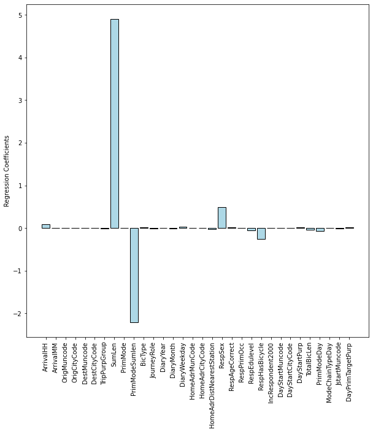

### Demographic analysis of the top 15 bike municipalities

Only looking at the 15 mostly biking municipalities in Denmark there is a close to equal distribution between male and female cyclists. There are 19700 female and 17156 male, hence the women/girls are overrepresented by 15% compared to the men/boys. The population pyramid below illustrates the age distribution for both genders. Surprisingly, the ten to fifteen year olds either constitute a big part of the trip dataset or they bike relatively more often than the other age groups.

Every cyclist in the transport survey bikes 2.56 trips per day on average. The bike is mostly used for travelling short distances around 2-4 km. Hence, people use the bike to go around in their close surroundings, but what is their purpose at the destination? Work? Education? Shopping? Luckily, the dataset includes this information, so we can investigate it through an interactive plot! The purpose of the bike trip is defined as the purpose at the destination that is opposite home. Hence, if a trip consists of *going home* from work, the purpose will still be Workplace. The Education category is going to/from school or another educational institution. Errand includes several activities, such as collecting/bringing others or going shopping. The Leisure category covers youth clubs, day care, church, visiting family or going to do sports. Lastly, Business describes purposes such as conferences, customer visits and other commercial transport.

This Bokeh plot below let's you investigate the bike trip purpose for people in different age groups across the 24 hours of day. You can read some of our conslucions underneath the plot, but we encourage you to do some exploration on your own at first!



**Age 5-19:** The youngest age group bikes to school in the morning between 7-8am and home again early in the afternoon at around 1-3pm. In the afternoon and evening hours, Leisure is their primary bike trip purpose, hence they bike to some sort of sparetime activity. People in this age group run very few errands and the Business category is also negligible. 
**Age 20-39:** From 20-39 years of age, the Educational purpose is almost entirely replaced by Workplace. Hence, people at this age have finished school and now bike to and from work instead. The day is a couple of hours longer for the 20-39 year olds than for the youngest age group and they go home from work at 3-5pm. Errand make out a large part of the bike trip purposes in the afternoon, but there is still time to leisure activities as well. 
**Age 40-59:** The bike habits for this age group are similar to those of people who are 20 years younger. They go to and from work at roughly the same times and spend the afternoon running errands an doing freetime activities. The Business purposes are uniformly distributed throughout the day, however, there is a decent number of business activities happening at midnight. Wonder what these could be 🤔... 
**Age 60-90:** At this age, only a few people still go to work so they have the time to run errands and to leisurely activities during the day between 9am and 4pm. Interestingly, the Errand category make out a majority of the bike trips at noon, which could be due to the fact that retirees like to get their shopping done between 10-12am when the stores aren't so crowded.

### Predicting Your Route Length
Due to the rather large amount of data collected, we attempted to make are supervised machine leraning model to predict the time that bike trip would take. For that reason both linear regression and decision tree regresion were developed. 

But first, in order to get some basic knowledge and intuition about the data we performed the Pearson correlation [1] among the parameters and presented it in a form of a heatmap. 

As our idea was to predict the time, we focused on the 'SumMin' category. It can be observed that the value is correlated with PrimModeSumlen - the primary mode of transport summed distance, total bicycle length, and summed distance. Those values seem to be quite intuitive as recorded trips with higher lengths will be probably longer and the trips with higher total distances performed on bike probably would have also recorded longer trips. First, we performed a linear regression on the gathered data. The resulted Mean Absolute Error was 3.87. To illustrate the importance of the features the weights of coefficients resulting from the regression are presented below. It can be observed that the most influence on the time of the bike trip has the 'SumLength' feature what makes perfect sense as when the distance is longer the time will be longer. The second and third higher weights are 'PrimamryModeSumLenght' and 'RespHasBicycle' respectively. This also checks out as owners of bikes probably choose to have better equipment and if the total sum of trips is higher that means that the endurance of the biker is higher which will result in lower trip time. Last it can be observed that men are a bit faster than women when it comes to biking.

Surprisingly the time of the year does not influence the trip time. However, the cause of it can be connected with the fact that people are more likely to cycle [2] when it is warmer. Therefore people cycling in winter can be more experienced ones.

To compare the result and feature importance, as said before, we also performed the Decision Tree-based regression. The Mean Absolute Error this time was lower: 3.15. By looking at the feature importance it can be observed that even though again 'SumLen' is the most important one the second and third are different than in Linear Regression. This actually highlights a very important fact, that feature importance may vary across different models and there is no best feature selection method [3].

By presenting the couple of first nodes of the treee we can actually observe that the first seven only takes into account the "SumLen" feature, what again underlines the importance of this element.

References: 

[1] rasbt, Pattern Classification, https://github.com/rasbt/pattern_classification/blob/master/resources/latex_equations.md#correlation---pearson

[2] How does the wether affect the share bicycle usage?, Danish Journal of Transportation Research, https://journals.aau.dk/index.php/djtr/article/download/3560/3106

[3] How to Choose a Feature Selection Method For Machine Learning, Jason Brownlee , https://machinelearningmastery.com/feature-selection-with-real-and-categorical-data/