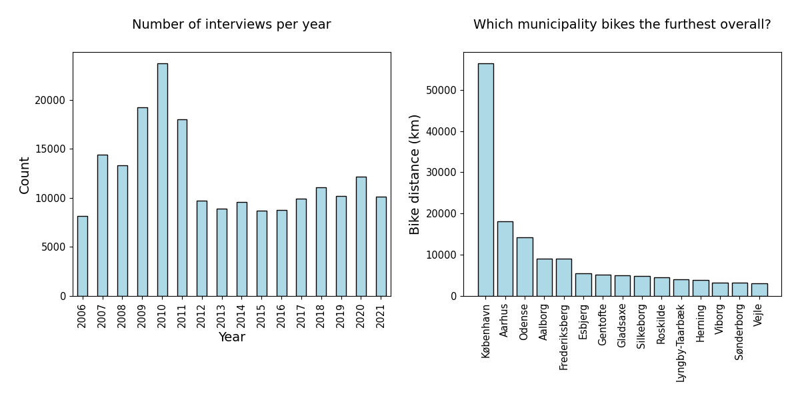

## Introduction  

### Motivation

Testing... In the battle against climate change, we need to find ways of minimizing greenhouse gas emissions. The transport sector is contributing greatly to the total emissions, hence finding green ways of transportation is key. Denmark is on of the most biking countries in the world - its a means of transport with no CO2 emission connected to it but lots of health benefits for the rider! Denmark is known for its' bike culture and the bike infrastructure of Danish cities is copied across the world. Therefore, we have decided to focus our project on Danish bicycle habits. We aim to answer questions such as: Who bikes? Which municipalities bike the most, the longest and the fastest? Has there been an increase in the use of electrical bikes?

### About the data source

The data used in this project comes from the Danish National Travel Survey (Transportvaneundersøgelsen), which is a survey that aims to gather information on the transport behaviour of Danes residing in Denmark. The survey is managed by DTU Transport on behalf of a group of Danish authorities and organisations. Here's some key points that describe the survey:

* Contains a one-day travel diary combined with various background questions
* Every day contains several trips with different modes of transport
* Covers 365 days a year
* Regards Danish residents, 10-84 years of age
* Interviews are performed from 2006-2021

**196006** one-day travel diaries in total

**139093** (71%) of participants owns a bike

**575629** trips in total

**88688** (15%) bike trips in total

In our analysis, we will use subsets of the dataset depending on the aim. In general, we focus on the trips where bicycle is the primary mode of transport. Furthermore, we might focus on the 15 top municipalities when it comes to total distance travelled as seen in the figure below.

Reference: Danish National Travel Survey, [DOI: 10.11581/dtu:00000034](https://www.cta.man.dtu.dk/transportvaneundersoegelsen/dokumentation)

