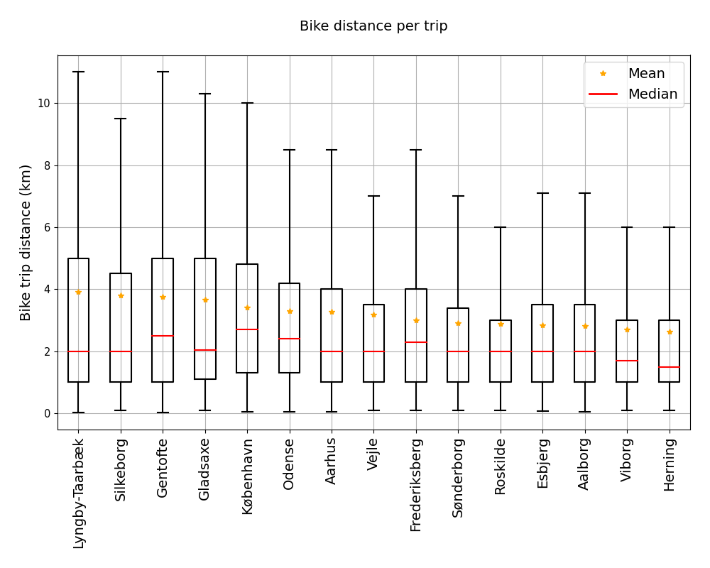

## The average biker

Here's a few points that describe the average Danish cyclist. If you regularly use the bike as a means of transport and you live in Denmark...

**This is about YOU!** (on average):
- Live in Copenhagen
- Bike 3.4 km per trip in a time of 15 min
- That equals a speed of 14.3 km/h
- Bike mostly during the late summer/autumn seasons
- Relax during the weekend

🚴‍♂️🚴‍♂️🚴‍♂️🚴‍♂️🚴‍♂️🚴‍♂️🚴‍♂️🚴‍♂️🚴‍♂️🚴‍♂️🚴‍♂️🚴‍♂️🚴‍♂️🚴‍♂️🚴‍♂️🚴‍♂️🚴‍🚴‍♂️🚴‍♂️🚴‍♂️🚴‍♂️🚴‍♂️🚴‍♂️🚴‍♂️🚴🚴‍♂️🚴‍♂️🚴‍♂️🚴‍♂️🚴‍♂️🚴‍♂️🚴‍♂️🚴‍♂️🚴‍♂️🚴‍♂️🚴‍♂️🚴‍♂️🚴‍♂️🚴‍♂️🚴‍♂️🚴‍♂️🚴‍♂️🚴‍♂️🚴‍♂️🚴‍♂️

You live in **Copenhagen** and usually make your way through the city on your beloved two wheels.

You bike around 4 km per trip, but it ranges between a few hundred meters and 10 kilometers. Half of the trips are less than or equal to 2 km as illustrated by the median in the figure below. Your cousins who live in Aalborg don't bike as far as you. On average, they bike 2.6 km per trip and you often advice them to use the bike more often - it's good for the environment! The boxplots visualize the distribution of bike distance per trip for the 15 municipalities that bike the furthest overall. These are sorted by the average distance such that its easy to see which municipality bikes the furthest per trip (on average). Outliers have been excluded but the mean, the median and interquartile ranges are illustrated in the figure. 

You have some friends who study at DTU in Lyngby and they bike to school every day. They are used to biking and usually bike a bit further and a bit faster than you. The Bokeh plot below gives an overview of the average bike distance per trip versus the average bike length for the same 15 municipalities that are included in the boxplots. Each bubble illustrates a municipality and the size of the bubble is proportional to the total number of bike trips in it. The dashed line illustrates the average speed. Municipalities above the line bike faster than the average whereas municipalities below bike slower.

**The average bike speed is 14.5 km/h**

Explore the average distance, durations and speeds in the interactive plot!



### Temporal analysis

The number of bicycle trips changes from day to day and hour to hour. To investigate the trends in biking habits across months, weekdays and hours, the visualization below contains a temporal analysis of the total bike trip count for the 15 municipalities we've seen above. **Months:** One would expect that people bike more during the summer than in the winter since the temperature is higher, and we see that this holds true when comparing the counts in January to those in August. However, it's a general trend that July has a relatively low number of bike trips which might be explained by the fact that most people are away on holiday. **Weekdays:** Investigating the Weekday trends, we can confirm that people don't use the bike when they have time off from school and work. The numbers drop significantly during the weekend. This also suggests that the bicycle is used for daily commute and not so much for leisure. **Hour:** Analysing the hourly bike counts, there is a peak in the morning from 7-8 am when people are making their way to school or work and again in the afternoon from 3-5 pm when they return home. Interestingly, the peak in the afternoon is broader, hence there is a bigger variation in the time of departure than in the time of arrival. **Hour of week:** The plots of the hourly bike trip count may hide some information for daily trends, since these are averaged out over the 24 hours. Therefore, we're plotting the hour of week instead to see the bike tendencies across days with "high resolution", i.e. showing the count per hour. This plot confirms that people bike more often during the weekdays than in the weekend. During the weekdays, people bike in the morning and the afternoon as we concluded before, however, it's opposite in the weekend. Saturday and Sunday people tend to bike during the day instead and we only see a single, broad peak in the bike trip count.

<iframe src="https://AndreasPiper.github.io/municipality/temporal_analysis.html"
	sandbox="allow-same-origin allow-scripts"
	width="100%"
	height="1000"
	scrolling="yes"
	seamless="seamless"
	frameborder="0">
</iframe>
